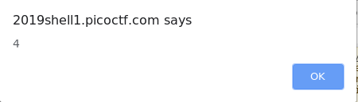
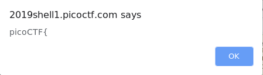

## Client side again ([Link](https://2019shell1.picoctf.com/problem/12278/))

- Đây là 1 bài Obfuscation khá vui, flag để trong đề troll những đứa chưa làm gì nhưng vẫn muốn submit mình bị dính và không hiểu vì sao lại sai, làm lại đàng hoàng mới thấy :v). Bài này tương tự như bài *dont-use-client-side*, tuy nhiên có khó hơn 1 chút do phải *decrypt* ra chứ nó không cho thẳng *source*

- Bài này mình chỉ nói sơ cách *decrypt*, *decript* xong thì làm lại như bài trên là ra thôi

- OK, thể loại bài này không phải sở trường của mình nên cách giải của mình cũng khá dở, tuy nhiên là ctf thì cách nào cũng là cách, miễn ra flag là được

- Đây là đoạn code đề cho

  ```javascript
  <script type="text/javascript">
    var _0x5a46=['0a0d8}','_again_4','this','Password\x20Verified','Incorrect\x20password','getElementById','value','substring','picoCTF{','not_this'];(function(_0x4bd822,_0x2bd6f7){var _0xb4bdb3=function(_0x1d68f6){while(--_0x1d68f6){_0x4bd822['push'](_0x4bd822['shift']());}};_0xb4bdb3(++_0x2bd6f7);}(_0x5a46,0x1b3));var _0x4b5b=function(_0x2d8f05,_0x4b81bb){_0x2d8f05=_0x2d8f05-0x0;var _0x4d74cb=_0x5a46[_0x2d8f05];return _0x4d74cb;};function verify(){checkpass=document[_0x4b5b('0x0')]('pass')[_0x4b5b('0x1')];split=0x4;if(checkpass[_0x4b5b('0x2')](0x0,split*0x2)==_0x4b5b('0x3')){if(checkpass[_0x4b5b('0x2')](0x7,0x9)=='{n'){if(checkpass[_0x4b5b('0x2')](split*0x2,split*0x2*0x2)==_0x4b5b('0x4')){if(checkpass[_0x4b5b('0x2')](0x3,0x6)=='oCT'){if(checkpass[_0x4b5b('0x2')](split*0x3*0x2,split*0x4*0x2)==_0x4b5b('0x5')){if(checkpass['substring'](0x6,0xb)=='F{not'){if(checkpass[_0x4b5b('0x2')](split*0x2*0x2,split*0x3*0x2)==_0x4b5b('0x6')){if(checkpass[_0x4b5b('0x2')](0xc,0x10)==_0x4b5b('0x7')){alert(_0x4b5b('0x8'));}}}}}}}}else{alert(_0x4b5b('0x9'));}}
  </script>
  ```

- Giờ kiếm đại cái *tool* nào đó trên mạng *decrypt* sơ sơ ra, không hy vọng nó *decrypt* được hết nhưng vẫn được phần nào

- OK, đây là tool mình xài để *decrypt*, cũng được kha khá: [Link](https://beautifier.io/)

  ```javascript
  <script type = "text/javascript" >
          var _0x5a46 = ['0a0d8}', '_again_4', 'this', 'Password\x20Verified', 'Incorrect\x20password', 'getElementById', 'value', 'substring', 'picoCTF{', 'not_this'];
      (function(_0x4bd822, _0x2bd6f7) {
          var _0xb4bdb3 = function(_0x1d68f6) {
              while (--_0x1d68f6) {
                  _0x4bd822['push'](_0x4bd822['shift']());
              }
          };
          _0xb4bdb3(++_0x2bd6f7);
      }(_0x5a46, 0x1b3));
      var _0x4b5b = function(_0x2d8f05, _0x4b81bb) {
          _0x2d8f05 = _0x2d8f05 - 0x0;
          var _0x4d74cb = _0x5a46[_0x2d8f05];
          return _0x4d74cb;
      };
  
      function verify() {
          checkpass = document[_0x4b5b('0x0')]('pass')[_0x4b5b('0x1')];
          split = 0x4;
          if (checkpass[_0x4b5b('0x2')](0x0, split * 0x2) == _0x4b5b('0x3')) {
              if (checkpass[_0x4b5b('0x2')](0x7, 0x9) == '{n') {
                  if (checkpass[_0x4b5b('0x2')](split * 0x2, split * 0x2 * 0x2) == _0x4b5b('0x4')) {
                      if (checkpass[_0x4b5b('0x2')](0x3, 0x6) == 'oCT') {
                          if (checkpass[_0x4b5b('0x2')](split * 0x3 * 0x2, split * 0x4 * 0x2) == _0x4b5b('0x5')) {
                              if (checkpass['substring'](0x6, 0xb) == 'F{not') {
                                  if (checkpass[_0x4b5b('0x2')](split * 0x2 * 0x2, split * 0x3 * 0x2) == _0x4b5b('0x6')) {
                                      if (checkpass[_0x4b5b('0x2')](0xc, 0x10) == _0x4b5b('0x7')) {
                                          alert(_0x4b5b('0x8'));
                                      }
                                  }
                              }
                          }
                      }
                  }
              }
          } else {
              alert(_0x4b5b('0x9'));
          }
      } 
  </script>
  ```

- Những thứ khác ta không quan tâm lắm, nhưng cần phải biết rõ 2 biến này có giá trị là gì:

  - `split = 0x4;`
  - `checkpass[_0x4b5b('0x2')](0x0, split * 0x2) == _0x4b5b('0x3')`

- Chỉ cần biết những phần tử như kia bên trong là gì thì ta sẽ giải được bài

- OK, mình có *trick* nhỏ là dùng *console* của *server* để tìm với điều kiện người ra đề không khóa nó đi :v

- VD thử với biến `0x4`, ta dùng câu lệnh `alert(0x4)`, để xem `0x4` là gì



- Tiếp tục, thử xem `_0x4b5b('0x3')` là gì với *alert()*



- OK. Vậy là cứ chịu khó dò như vậy thì bạn sẽ có tất cả các biến quan trọng của đề. Có để viết 1 tool nhỏ với js tuy nhiên biến cũng ít, làm tay cho nhanh, tool làm gì :v 
