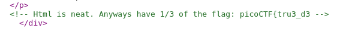
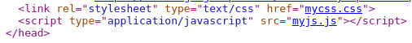

# Insp3ct0r ([link](https://2019shell1.picoctf.com/problem/9509/))

- 1 bài *view source* cơ bản, câu này cơ bản là câu cho điểm, chỉ đơn giản là yêu cầu người chơi biết *view source*, biết đuôi của file *js*, *css* là gì. Mở cả 3 file lên *(html, css, js)* là có *flag*

- Part 1 ở đây 

  

- File *css và js* ở đây

  

- Part 2 và part 3

  

  

  

  

  
