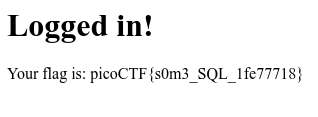

## Irish Name Repo 1 ([Link](https://2019shell1.picoctf.com/problem/27383/))

- Đây là 1 câu sql rất cơ bản ( thực sự thì bài này mình viết cho câu khác, nhưng 2 câu giống nhau nên mình coppy luôn cho nhanh :v )

- Ta có thể đoán câu *query* của đề như sau:

  - `SELECT * FROM user WHERE username='$user' and password = '$password'`

- Ta có thể qua dễ dàng nếu *dev*  không filter các ký tự để tránh chúng ta bypass qua sql

- Chúng ta chỉ cần tiêm vô *username và password* thành:

  - `admin' OR '1' = '1`

- Lúc đó câu query gốc sẽ trở thành:

  - `SELECT * FROM user WHERE username='admin' OR '1' = '1' and password = 'admin' OR '1' = '1'`

- Payload của ta cố tình thiếu dấu `'` ở cuối cùng để nó nối với câu query của đề sao cho hoàn chình, không bị lỗi xảy ra

- Lúc này biến *$user* và *$pass* có là gì thì cũng không quan trọng, chúng bị biến thành toán tử `OR`, tức là *A đúng hay B đúng hoặc cả A và B đều đúng*, chúng ta đã thành công trong việc tạo ra mệnh đề *'1' = '1'*, chúng luôn đúng với mọi trường hợp. Vậy dù *$user* và *$pass* có sai thì ta vẫn vẫn luôn có mệnh đề đúng, Vậy câu *query* đó luôn chạy

- Nói dài vậy đủ rồi, flag đây

