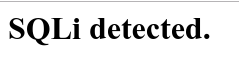
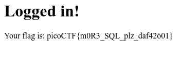

## Irish Name Repo 2 ([Link](https://2019shell1.picoctf.com/problem/40968/))

- Đây là 1 câu sql rất cơ bản, tuy nhiên đã bị filer 1 số thứ

- Ta có thể đoán câu *query* của đề như sau:

  - `SELECT * FROM user WHERE username='$user' and password = '$password'`

- Sau vài lần thử, ta có thể thấy người ra đề *filter* đi câu điều kiện *OR*. Tuy nhiên ta vẫn còn cách khác để bypass qua bài này

- Đọc đề, nhìn xung quanh, coi kỹ hint, hay nói dễ hơn đây là kinh nghiệm. Ta có thể đoán được là *user* của admin là admin. Cái này quá dễ rồi

- OK, giả sử ta có được *username* là *admin* rồi. Hint nói tiếp là *The password is being filtered.*

- Đề gợi ý rõ là *password* bị filter rồi, tức là có cố gắng bypass qua hướng *passwork* thì chịu

- Giờ làm sao khi *passwork* bị filter đây. Câu trả lời đơn giản là đánh dấu nó thành *comment* là xong

- Rồi, payload có thể làm được điều đó là đây 

  - `admin'--`

- Lúc đó câu query gốc sẽ trở thành:

  - `SELECT * FROM user WHERE username='admin'-- and password = 'admin'`

- Payload của ta đã biến tất cả câu query phía sau thành *comment*, giờ dễ rồi, nếu *username* là *admin* là câu query sẽ chạy

- OK, trời không phụ lòng người. Username đúng là *admin*. Thế là ta đã có flag

