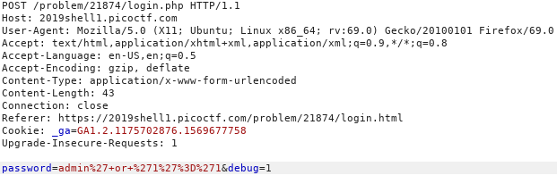
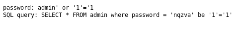
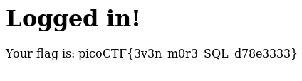

## Irish Name Repo 3 ([Link](https://2019shell1.picoctf.com/problem/21874/))

- Đây là 1 câu sql khá hay. Nó dễ nếu chịu để ý, khó nếu không để ý chi tiết nhỏ mà lao đầu vào bypass

- Thực sự thì nó chỉ cho ta 1 ô *password*, cố bypass 1 hồi thì thấy vô vọng. Nó trắng xóa, chả cho ta dữ liệu gì cả

- Giờ đi soi lại *source* thì thấy 1 tham số *bug*. Thường thì tham số này dùng cho người ra đề phòng khi lỗi để dễ sửa *code*

- Giờ ta lợi dụng nó, sử dụng `Burp suite` để đổi tham số đó từ 0 sang 1. Sử dụng thử payload cơ bản xem thế nào:

  - `admin' OR '1' ='1`

- OK, quá ngon. Nó show hẳn cho mình coi câu query cho mình xem

- Để ý thì đoạn *password* mình nhập vào nó kỳ kỳ. Nó chuyển từ `admin' OR '1' ='1` sang `nqzva' BE '1' ='1`

- Nghĩ ngay tới kỹ thuật lật bit, mong là nó lât theo xuôi ngược. Thử lấy các payload `nqzva' BE '1' ='1` đem đi nhập lại vào biến password. Xem nó có lật theo chiều ngược lại không

- Quá may mắn, có flag luôn. Bài này quan trọng nhất là chuyển *bug* từ 0 sang 1

