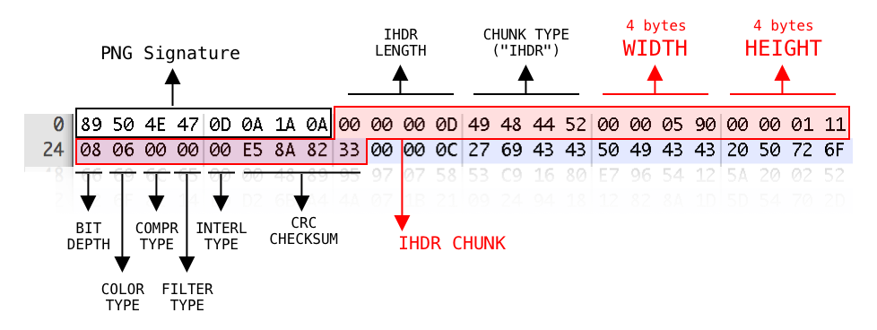

#### Java Script Kiddie ([Link](https://2019shell1.picoctf.com/problem/10188/))

-  Bài này chả biết nói sao, mình còn chả biết nó có phải vấn đề liên quan đến *web* không nữa.  Chỉ có *js* là *web*, còn lại là dựa vào kiến thức của *forensic* về png

- Bức ảnh đã cứu rỗi bài này của mình:

  

- Từ đây ta có 16 bít đầu của ảnh, tương đương với 16 ký tự của key

- Ta chỉnh sửa lại code *js* để từ những bit trên đổi thành bit của đề đã cho (lưu ý đổi ảnh trên từ hex sang decimal). Mình đổi sẵn cho đỡ mất công

  - `137 80 78 71 13 10 26 10 0 0 0 13 73 72 68 82`

- Ở đây mình cần các bạn đọc hiểu code và thuật toán của đề, chứ mình không giải thích lại. Chịu khó *research* 1 hồi là ra

- Code *js* của đề:

  ```javascript
  <script>
      var bytes = [];
      $.get("bytes", function(resp) {
          bytes = Array.from(resp.split(" "), x => Number(x));
      });
  
      function assemble_png(u_in){
          var LEN = 16;
          var key = "0000000000000000";
          var shifter;
          if(u_in.length == LEN){
              key = u_in;
          }
          var result = [];
          for(var i = 0; i < LEN; i++){
              shifter = key.charCodeAt(i) - 48;
              for(var j = 0; j < (bytes.length / LEN); j ++){
                  result[(j * LEN) + i] = bytes[(((j + shifter) * LEN) % bytes.length) + i]
              }
          }
          while(result[result.length-1] == 0){
              result = result.slice(0,result.length-1);
          }
          document.getElementById("Area").src = "data:image/png;base64," + btoa(String.fromCharCode.apply(null, new Uint8Array(result)));
          return false;
      }
  </script>
  ```

  

- OK, 16 bit đầu của *png header* này chính là 16 bit đầu của mảng *result*. Tức là giá trị của mảng *bytes* tại vị trí `(((j + shifter) * LEN) % bytes.length) + i`

  - `i` ta đã có, với mỗi *i* là 1 vị trí của bit. Giả sử *bit 137* thuộc vị trí đầu tiên, tức *i=0*,...
  - `LEN` = 16
  - `j` là số nhóm bit, bài này chia ra *n* nhóm bit (bao nhiêu nhóm mình quên rồi, lười mò lại), mỗi nhóm bit có 16 bit, tức là ta chỉ xét 1 nhóm bit đầu. Tức là  *j=0*
  - `bytes.length`: là độ dài của lenght (bằng 688)
  - `shifter` chính là thứ mà ta cần, từ *shifter* ta có thể suy ra được ký tự tạo nên bit đúng của đề

- Tuy nhiên, không chỉ có 1 ký tự hợp lệ, đời không như mơ

- Code *js* mình chỉnh lại để lấy ra ký từ có thể tạo nên các bit đúng

  ```javascript
  		<script>
  			var bytes = ['61', '180', '159', '7', '201', '26', '191', '0', '0', '57', '0', '231', '213', '73', '8', '69', '156', '215', '207', '255', '127', '96', '246', '10', '1', '200', '0', '0', '185', '119', '34', '187', '123', '249', '63', '94', '225', '10', '134', '114', '84', '210', '0', '0', '157', '0', '73', '67', '73', '78', '68', '207', '121', '0', '216', '65', '128', '75', '156', '13', '0', '0', '28', '249', '44', '80', '78', '59', '251', '73', '180', '84', '101', '89', '160', '0', '0', '72', '134', '73', '205', '0', '1', '78', '229', '2', '151', '236', '145', '244', '5', '237', '73', '192', '170', '0', '69', '0', '0', '174', '153', '0', '223', '114', '56', '222', '233', '71', '0', '77', '222', '82', '137', '12', '70', '71', '66', '198', '147', '83', '204', '105', '239', '223', '155', '111', '0', '108', '0', '13', '236', '114', '13', '240', '130', '193', '249', '0', '3', '45', '177', '36', '0', '227', '164', '65', '166', '2', '0', '88', '26', '15', '219', '0', '237', '188', '44', '16', '68', '51', '48', '182', '137', '31', '110', '95', '1', '96', '175', '0', '227', '172', '8', '206', '95', '137', '205', '243', '127', '163', '199', '38', '68', '58', '123', '120', '133', '1', '243', '98', '110', '63', '139', '110', '67', '168', '228', '202', '178', '227', '65', '30', '154', '252', '227', '151', '214', '239', '82', '71', '4', '207', '235', '40', '5', '211', '192', '0', '206', '173', '166', '240', '197', '213', '188', '55', '37', '227', '216', '176', '3', '76', '249', '31', '122', '36', '247', '113', '20', '79', '189', '44', '23', '127', '173', '27', '235', '223', '75', '56', '226', '181', '253', '109', '59', '205', '76', '155', '249', '141', '156', '103', '128', '142', '156', '172', '207', '54', '166', '254', '48', '29', '218', '127', '137', '172', '128', '206', '139', '16', '41', '171', '203', '7', '234', '98', '252', '113', '62', '4', '183', '134', '139', '82', '1', '36', '149', '248', '141', '219', '224', '51', '83', '63', '254', '233', '32', '246', '227', '1', '186', '124', '102', '153', '67', '189', '51', '227', '126', '71', '206', '206', '223', '175', '20', '192', '134', '96', '206', '0', '28', '158', '250', '243', '253', '2', '193', '38', '73', '35', '249', '249', '183', '63', '172', '146', '206', '75', '103', '126', '160', '74', '237', '108', '254', '160', '144', '191', '5', '5', '32', '240', '9', '85', '230', '175', '16', '249', '124', '53', '143', '197', '81', '83', '243', '151', '229', '127', '189', '171', '59', '190', '59', '82', '7', '49', '229', '162', '144', '124', '228', '11', '35', '150', '148', '235', '178', '9', '252', '141', '255', '166', '131', '59', '29', '150', '144', '99', '127', '77', '4', '230', '143', '246', '223', '145', '230', '120', '74', '239', '255', '17', '104', '35', '201', '149', '143', '170', '182', '224', '67', '83', '117', '75', '254', '76', '94', '252', '74', '247', '55', '152', '252', '245', '230', '154', '141', '249', '0', '127', '231', '96', '86', '121', '41', '127', '177', '135', '168', '26', '200', '244', '162', '250', '21', '148', '114', '93', '50', '222', '169', '141', '107', '175', '172', '157', '117', '172', '245', '159', '187', '31', '69', '166', '133', '119', '63', '255', '131', '139', '132', '210', '65', '161', '199', '67', '205', '44', '188', '31', '254', '127', '22', '223', '57', '231', '241', '218', '123', '174', '246', '186', '75', '30', '223', '253', '88', '48', '10', '226', '197', '151', '15', '134', '106', '86', '119', '254', '173', '229', '241', '83', '245', '17', '198', '87', '127', '105', '67', '199', '241', '148', '156', '53', '166', '75', '16', '252', '71', '127', '221', '82', '171', '237', '53', '26', '215', '117', '34', '87', '230', '27', '193', '157', '124', '46', '124', '234', '121', '215', '97', '20', '249', '104', '101', '126', '185', '254', '56', '221', '242', '148', '37', '71', '73', '223', '65', '42', '4', '207', '186', '107', '129', '68', '201', '241', '31', '223', '243', '87', '247', '14', '217', '175', '75', '249', '88', '203', '124', '201', '222', '20', '61', '49', '115', '246', '126', '196', '178', '153', '170', '239', '175', '39', '86', '122', '124', '191', '146', '249', '28', '75', '185', '182', '127', '106', '13', '193', '249', '109', '209', '190', '255', '235', '46', '127', '1', '250', '118', '223', '66', '252', '100', '254', '251', '115', '174', '255', '2', '255', '239', '227', '213', '239', '239', '74', '121', '139', '37', '123', '148', '147', '254', '42', '79', '119', '238', '205', '249', '190', '0', '139', '200', '99', '56', '235', '106', '127'];
  
  			function assemble_png(){
  				var LEN = 16;
  				var I = 0;
  				var Bit = 137;
                  // `137 80 78 71 13 10 26 10 0 0 0 13 73 72 68 82
  				var shifter;
  				var char = ['0', '1', '2', '3', '4', '5', '6', '7', '8', '9', 'a', 'b', 'c', 'd', 'e', 'f', 'g', 'h', 'i', 'j', 'k', 'l', 'm', 'n', 'o', 'p', 'q', 'r', 's', 't', 'u', 'v', 'w', 'x', 'y', 'z', 'A', 'B', 'C', 'D', 'E', 'F', 'G', 'H', 'I', 'J', 'K', 'L', 'M', 'N', 'O', 'P', 'Q', 'R', 'S', 'T', 'U', 'V', 'W', 'X', 'Y', 'Z'];
  
  				var result = [];
  
  				for(var i = 0; i < char.length; i++){
  					shifter = char[i].charCodeAt(0) - 48;
  					result[(0 * LEN) + I] = bytes[(((0 + shifter) * LEN) % bytes.length) + I]
  					if (result[I] == Bit) {alert(char[i]);}
  				}
  			}
  			assemble_png();
  		</script>
  ```

- Mảng *bytes* mình lấy từ [link](https://2019shell1.picoctf.com/problem/10188/bytes) này để thuận tiện giải off

- Code trên để lấy ký tự đầu với *i = 0*

- Muốn lấy ở bit thứ 2 ta chỉ cần chỉnh lại thông số i và bit đúng

- Ở đây mình lười viết 1 tool hoàn chình nên làm tay từng cái 1 luôn cho tiện :v

- Sau 1 hồi làm tay thì mình có các ký tự có thể tạo ra bit đúng là đây (mình thấy cũng khá nhanh, không đến nỗi quá chậm)

  ```javascript
  i = 0 => ['7', 'b']
  i = 1 => ['4']
  i = 2 => ['4']
  i = 3 => ['7', 'b']
  i = 4 => ['8', 'c']
  i = 5 => ['2']
  i = 6 => ['9', 'd']
  i = 7 => ['1']
  i = 8 => ['0', 'Z']
  i = 9 => ['8', '9', 'c', 'd', 'e', 'h', 'o', 'D']
  i = 10 => ['0', '1', '2']
  i = 11 => ['3']
  i = 12 => ['5']
  i = 13 => ['4']
  i = 14 => ['9', 'd']
  i = 15 => ['6', 'a', 'r', 'G']
  ```

- OK, giờ key của mình có dạng `x44xx2x1xxx354xx`

- Giờ chơi kiểu trâu bò,  làm luôn 9 vòng *for* cho 9 ký tự còn lại chưa xác định, *brute force* nó cho hiện hết ảnh ra, nếu không hiện thì không hợp lệ, hiện ảnh thì ta có ký. Đơn giản dễ hiểu. Vì giới hạn ký tự ít nên 9 vòng *for* có thể chạy được. Có thể dùng thuật toán, cơ mà mình lười nên thôi

- Code *js* để *brute force* đáp án. Không khuyến khích làm 9 vòng *for* như mình, nên giải theo thuật toán, mình lười nên làm 9 vòng *for* cho đỡ phải suy nghĩ nhiều

  

  ```javascript
  	<script>
  		var bytes = ['61', '180', '159', '7', '201', '26', '191', '0', '0', '57', '0', '231', '213', '73', '8', '69', '156', '215', '207', '255', '127', '96', '246', '10', '1', '200', '0', '0', '185', '119', '34', '187', '123', '249', '63', '94', '225', '10', '134', '114', '84', '210', '0', '0', '157', '0', '73', '67', '73', '78', '68', '207', '121', '0', '216', '65', '128', '75', '156', '13', '0', '0', '28', '249', '44', '80', '78', '59', '251', '73', '180', '84', '101', '89', '160', '0', '0', '72', '134', '73', '205', '0', '1', '78', '229', '2', '151', '236', '145', '244', '5', '237', '73', '192', '170', '0', '69', '0', '0', '174', '153', '0', '223', '114', '56', '222', '233', '71', '0', '77', '222', '82', '137', '12', '70', '71', '66', '198', '147', '83', '204', '105', '239', '223', '155', '111', '0', '108', '0', '13', '236', '114', '13', '240', '130', '193', '249', '0', '3', '45', '177', '36', '0', '227', '164', '65', '166', '2', '0', '88', '26', '15', '219', '0', '237', '188', '44', '16', '68', '51', '48', '182', '137', '31', '110', '95', '1', '96', '175', '0', '227', '172', '8', '206', '95', '137', '205', '243', '127', '163', '199', '38', '68', '58', '123', '120', '133', '1', '243', '98', '110', '63', '139', '110', '67', '168', '228', '202', '178', '227', '65', '30', '154', '252', '227', '151', '214', '239', '82', '71', '4', '207', '235', '40', '5', '211', '192', '0', '206', '173', '166', '240', '197', '213', '188', '55', '37', '227', '216', '176', '3', '76', '249', '31', '122', '36', '247', '113', '20', '79', '189', '44', '23', '127', '173', '27', '235', '223', '75', '56', '226', '181', '253', '109', '59', '205', '76', '155', '249', '141', '156', '103', '128', '142', '156', '172', '207', '54', '166', '254', '48', '29', '218', '127', '137', '172', '128', '206', '139', '16', '41', '171', '203', '7', '234', '98', '252', '113', '62', '4', '183', '134', '139', '82', '1', '36', '149', '248', '141', '219', '224', '51', '83', '63', '254', '233', '32', '246', '227', '1', '186', '124', '102', '153', '67', '189', '51', '227', '126', '71', '206', '206', '223', '175', '20', '192', '134', '96', '206', '0', '28', '158', '250', '243', '253', '2', '193', '38', '73', '35', '249', '249', '183', '63', '172', '146', '206', '75', '103', '126', '160', '74', '237', '108', '254', '160', '144', '191', '5', '5', '32', '240', '9', '85', '230', '175', '16', '249', '124', '53', '143', '197', '81', '83', '243', '151', '229', '127', '189', '171', '59', '190', '59', '82', '7', '49', '229', '162', '144', '124', '228', '11', '35', '150', '148', '235', '178', '9', '252', '141', '255', '166', '131', '59', '29', '150', '144', '99', '127', '77', '4', '230', '143', '246', '223', '145', '230', '120', '74', '239', '255', '17', '104', '35', '201', '149', '143', '170', '182', '224', '67', '83', '117', '75', '254', '76', '94', '252', '74', '247', '55', '152', '252', '245', '230', '154', '141', '249', '0', '127', '231', '96', '86', '121', '41', '127', '177', '135', '168', '26', '200', '244', '162', '250', '21', '148', '114', '93', '50', '222', '169', '141', '107', '175', '172', '157', '117', '172', '245', '159', '187', '31', '69', '166', '133', '119', '63', '255', '131', '139', '132', '210', '65', '161', '199', '67', '205', '44', '188', '31', '254', '127', '22', '223', '57', '231', '241', '218', '123', '174', '246', '186', '75', '30', '223', '253', '88', '48', '10', '226', '197', '151', '15', '134', '106', '86', '119', '254', '173', '229', '241', '83', '245', '17', '198', '87', '127', '105', '67', '199', '241', '148', '156', '53', '166', '75', '16', '252', '71', '127', '221', '82', '171', '237', '53', '26', '215', '117', '34', '87', '230', '27', '193', '157', '124', '46', '124', '234', '121', '215', '97', '20', '249', '104', '101', '126', '185', '254', '56', '221', '242', '148', '37', '71', '73', '223', '65', '42', '4', '207', '186', '107', '129', '68', '201', '241', '31', '223', '243', '87', '247', '14', '217', '175', '75', '249', '88', '203', '124', '201', '222', '20', '61', '49', '115', '246', '126', '196', '178', '153', '170', '239', '175', '39', '86', '122', '124', '191', '146', '249', '28', '75', '185', '182', '127', '106', '13', '193', '249', '109', '209', '190', '255', '235', '46', '127', '1', '250', '118', '223', '66', '252', '100', '254', '251', '115', '174', '255', '2', '255', '239', '227', '213', '239', '239', '74', '121', '139', '37', '123', '148', '147', '254', '42', '79', '119', '238', '205', '249', '190', '0', '139', '200', '99', '56', '235', '106', '127'];
  
  		var vt1 =  ['7', 'b']
  		var vt4 =  ['7', 'b']
  		var vt5 =  ['8', 'c']
  		var vt7 =  ['9', 'd']
  		var vt9 =  ['0', 'Z']
  		var vt10 =  ['8', '9', 'c', 'd', 'e', 'h', 'o', 'D']
  		var vt11 =  ['0', '1', '2']
  		var vt15 =  ['9', 'd']
  		var vt16 =  ['6', 'a', 'r', 'G']
  
  		function assemble_png(){
  			var LEN = 16;
  
  			for (var a = 0; a < vt1.length; a++) {
  				for (var b = 0; b < vt4.length; b++) {
  					for (var c = 0; c < vt5.length; c++) {
  						for (var d = 0; d < vt7.length; d++) {
  							for (var e = 0; e < vt9.length; e++) {
  								for (var f = 0; f < vt10.length; f++) {
  									for (var g = 0; g < vt11.length; g++) {
  										for (var h = 0; h < vt15.length; h++) {
  											for (var k = 0; k < vt16.length; k++) {
  												key = vt1[a] + '44' + vt4[b] + vt5[c] + '2' + vt7[d] + '1' + vt9[e] + vt10[f] + vt11[g] + '354' + vt15[h] + vt16[k];
  														var result = [];
  														for(var i = 0; i < LEN; i++){
  															shifter = key.charCodeAt(i) - 48;
  															for(var j = 0; j < (bytes.length / LEN); j ++){
  																result[(j * LEN) + i] = bytes[(((j + shifter) * LEN) % bytes.length) + i]
  															}
  														}
  														while(result[result.length-1] == 0){
  															result = result.slice(0,result.length-1);
  														}
  														var img = btoa(String.fromCharCode.apply(null, new Uint8Array(result)));
  														document.write('');
  											}
  										}
  									}
  								}
  							}
  						}
  					}
  				}
  			}
  		}
  		assemble_png();
  	</script>
  ```

- Chạy code trên loacahost, tầm vài giây là ra rồi

  

  

