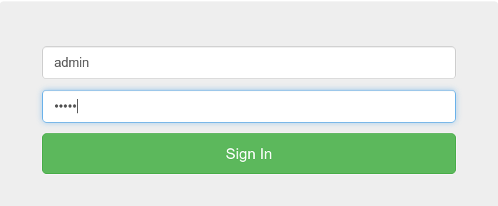
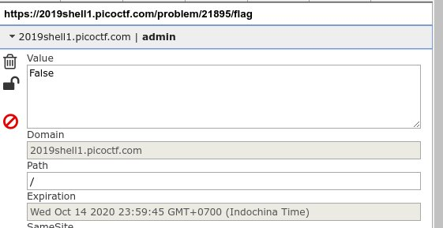
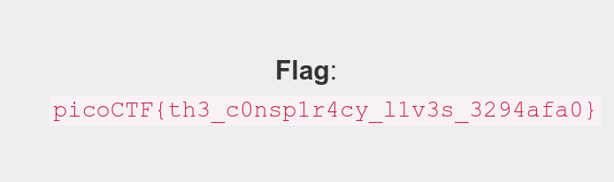

# logon ([Link](https://2019shell1.picoctf.com/problem/45147/))

- Bắt đầu *challenge* bằng 1 *form*, thử login xem nào

  

- Sau khi *login* thì thế này

  

- Có thể thấy dù *login* với *user* và *pass* nào thì cũng thấy dòng thông báo trên. Thử xem có cơ chế xác thực nào trên *cookie* không, vì phần đa các bài từ *easy* đến *medium* đều liên quan tới *cookie*

  

- Ta thấy có 1 *cookie* với *key* là *admin* và *value* là *Flalse*, có thể suy luận ra được ngay là nếu đổi *value* từ *False* sang *True* thì *server* sẽ xác thực ta với tư cách là *admin*

- Sau khi sửa thì ta có *flag* như thế này

  

  
