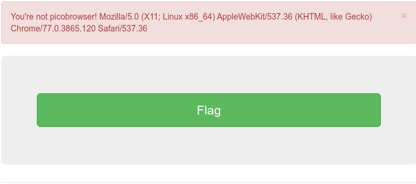
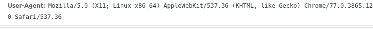
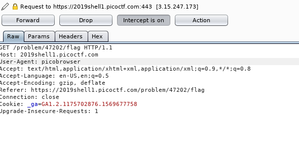
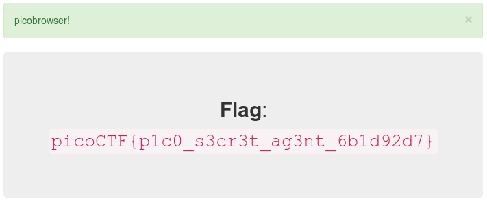

# picobrowser ([Link](https://2019shell1.picoctf.com/problem/37878/))

- Vừa vào *challenge* thì thấy 1 *button flag*, thử click vào xem sao

  

- Nhìn sơ qua thì có vẻ liên quan tới *User-Agent* của *HTTP Request Header*. Có vẻ *server* lấy *User-Agent* để *acess* quyền *admin*.

- Nếu chưa biết về *HTTP Request Header* thì tham khảo: [Link](https://techtalk.vn/http-header-la-cai-gi-phan-1.html)

- Đây là *User-Agent* mặc định của máy mình

  

- Ta có thể thay đổi giá trị đó nhờ `Burp suite`

- Vào `Burp suite` để *intercept* request  lại, chỉnh sửa giá trị của *User-Agent* thành *picobrowser* như đề yêu cầu

  

- *Forward* và nhận *flag*

  
