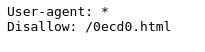
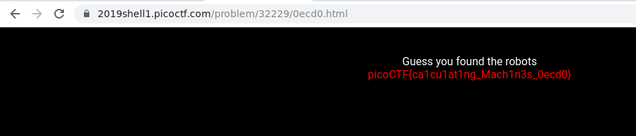

# where are the robots ([Link](https://2019shell1.picoctf.com/problem/32229/))

- Ngay từ cái tên của đề bài là *where are the robots*, kèo này chắc chắn là có liên quan tới file *robots.txt*

- Nếu chưa biết file *robots.txt* thì tham khảo link sau: [Link](https://jpwebseo.com/file-robots-txt-la-gi-cach-su-dung-robot-txt-khi-lam-seo)

- Sửa ngay *url* để đến file *robots.txt* : `https://2019shell1.picoctf.com/problem/32229/robots.txt`

  

- Ta thấy được *endpoint* này bị *disallow* bởi file *robots.txt*, thử load *endpoint* trên với url xem sao

- Không bất ngờ lắm, file *html* này chưa flag

  
